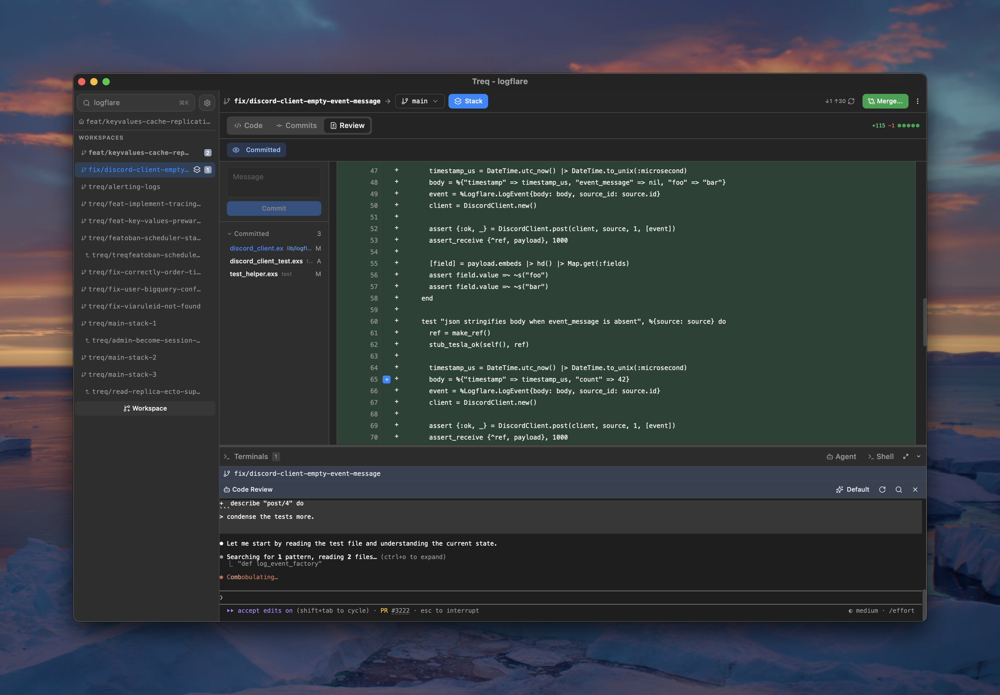
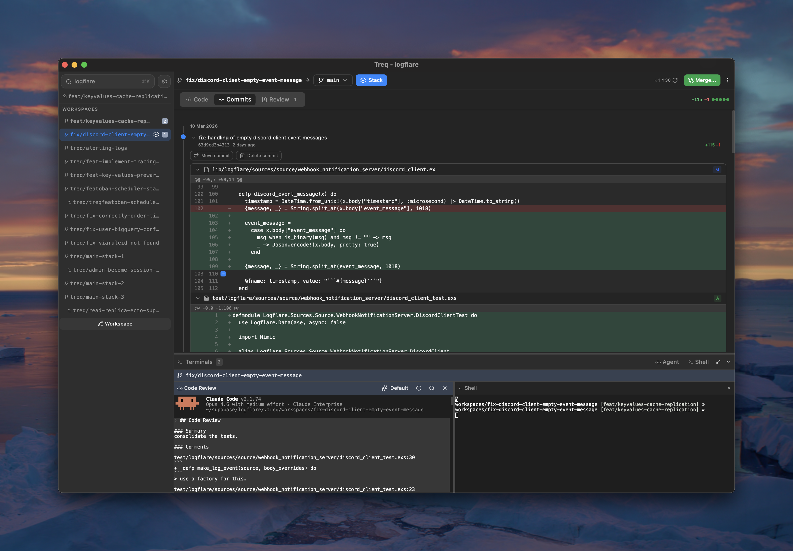

<div align="center">


</div>

# treq

Treq is your AI Code Review Manager, accelerating AI-assisted software development while maintaining high quality code. Treq is an open-source Graphite alternative with a focus on paralleized development using AI agents.

_Treq was used to build Treq._


## Getting Started

Pre-requisites:
- Git
- [Jujitsu](https://docs.jj-vcs.dev/latest/install-and-setup/) _You don't need to know how to use it_


Download the latest release [here](https://github.com/Ziinc/treq/releases).
```

```

## Features

### Code Reviews

Inspect and iterate on each change for a human-in-the-loop agentic workflow.



- Review the code diffs just like a familiar Github PR, annotate and comment on code, and then send it to an agent for changes.
- Spotted an issue when browsing files? Send it to an agent for adjustments in the background.
- Got a specific commit that you want the agent to work on, review it and send your comments directly to the agent. Did I mention that we have commit management tooling as well?



### Workspaces

Coding agents work in isolated copies of the codebase, ensuring changes are independent from each other while keeping your current repository clean for planning.

<!-- insert gif of worktree creation -->

- Workspaces are isolated but and **automatically rebased**, meaning code never goes stale.

- Got a code conflict? Agents can **automatically resolve your conflicts**.

- Stack workspaces and build features incrementally over smaller bite-sized branches. All stacked workspaces automatically rebases on top of each other, **even on top of your uncommitted changes**.

<!-- insert gif of stacking -->

## License

Licensed under the Apache License, Version 2.0
