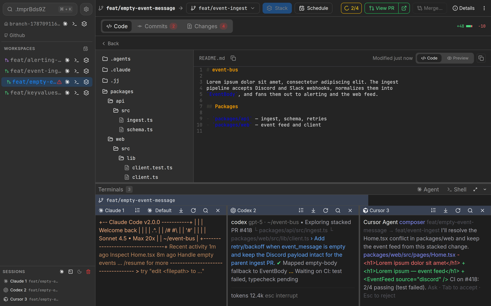

<div align="center">


</div>

# treq

Treq is the open-source Stacking Agent Development Environment (ADE). It gives each agent its own workspace, stacks branches, and rebases when the base moves. Reviews stay on disk until you push.



## Getting Started

Download the latest release [here](https://github.com/Ziinc/treq/releases). Install steps are in the [installation docs](https://treq.dev/docs/getting-started/installation).

## Features

- [Code reviews](https://treq.dev/docs/concepts/changes-and-reviews). Inspect diffs on your machine. Comment on lines. Send Plan or Edit to an agent. See the [code review workflow](https://treq.dev/docs/tutorials/code-review-workflow).
- Isolated [workspaces](https://treq.dev/docs/concepts/workspaces). Each agent gets its own checkout. Uncommitted work in one workspace does not appear in another.
- Auto-rebase. When a target branch moves, Treq rebases dependent workspaces. [Managing workspaces](https://treq.dev/docs/tutorials/managing-workspaces) covers stacks.
- Conflict resolution. Send a conflict from Changes with Plan or Edit. On Commits, Resolve conflicts rewrites the conflicted commit in place. See [merging workspaces](https://treq.dev/docs/tutorials/merging-workspaces).
- Agent CLI. Agents create workspaces and move work with the same [CLI](https://treq.dev/docs/reference/cli) you run. [Agent sessions](https://treq.dev/docs/concepts/agent-sessions) lists supported agents.
- [Move files between workspaces](https://treq.dev/docs/how-to/moving-files-between-workspaces). Agents can move commits, working-copy files, and hunks.
- Send files from a terminal. A thumbnail lands in the pane. Click it to open the file. See [terminal sessions](https://treq.dev/docs/concepts/terminal-sessions).
- Schedule work. Hide a workspace until a time you pick. Shift commit timestamps, or set them to now.
- [GitHub issues and pull requests](https://treq.dev/docs/concepts/github-integration). Start an agent from an issue. CI stays next to the workspace. How-to: [connecting GitHub](https://treq.dev/docs/how-to/connecting-github) and [creating pull requests](https://treq.dev/docs/how-to/creating-and-viewing-pull-requests).

## Developer

### Regenerating screenshots

The committed hero is `assets/screenshots/code.png`. Other marketing crops write to `web/static/img/landing/` and are gitignored.

A Docusaurus production build runs `npm run screenshot:readme` when those landing files are missing. Set `SKIP_LANDING_SCREENSHOTS=1` to skip that step. Set `FORCE_LANDING_SCREENSHOTS=1` to recapture even when files exist.

```bash
npm run screenshot:readme
# same as
npm run screenshot:landing
```

Specs live at `scripts/screenshot/specs/readme-*.spec.tsx`.

### Bumping the version

```bash
make bump           # prompts for the new version
make bump VERSION=0.1.3   # non-interactive
```

Updates `package.json`, `src-tauri/tauri.conf.json`, `src-tauri/Cargo.toml`, and `src-tauri/Cargo.lock` in one step.

```bash
# to profile benchmark code
samply record cargo bench --bench sync_workspaces
```

## License

Licensed under the Apache License, Version 2.0
